## ¿Qué diferencia a Javascript de cualquier otro lenguaje de programación?

JavaScript (JS) es un programa multiplataforma de alto nivel interpretado el cual se usa principalmente para crear páginas web interactivas y aplicaciones. La principal diferencia con los demás lenguajes de programación es que fue desarrollado para correr directamente en el navegador sin herramientas adicionales. Esto permite que la interpretación se haga en el lado del cliente y no del servidor de contenido. Java, por ejemplo, debe ser interpretado por el servidor. Una consecuencia de esto es que podemos usar JS para automatizar tareas (p.ej., descargar las imágenes de una página web). Respecto al desarrollo de aplicaciones, JS se ha convertido en un lenguaje indispensable para la creación de aplicación para teléfonos móviles, puesto que permite acceder a todas las partes del teléfono como, por ejemplo, la cámara o el acelerómetro. 

Otra característica distintiva es que JS es un lenguaje con tipado dinámico, lo que significa que no hace falta declarar el tipo de las variables como pasa en C, C++ o Fortran. Además, JS también es un lenguaje denominado de tipado muy débil, lo cual hace referencia a que es muy flexible a la hora de realizar operaciones con tipos de datos distintos. Per ejemplo, JS permite cambios de tipo una vez creada una variable lo que no se permiten en lenguajes de tipado fuerte como C# o Java. A modo de ejemplo, el siguiente código crea una variable llamada `var` la cual contiene inicialmente una cadena de caracteres. Este valor almacenado en la variable es subsecuentemente cambiado para contener un número entero y a continuación una variable Booleana (es decir, verdadero o falso). Como se puede apreciar, el código funciona perfectamente. 

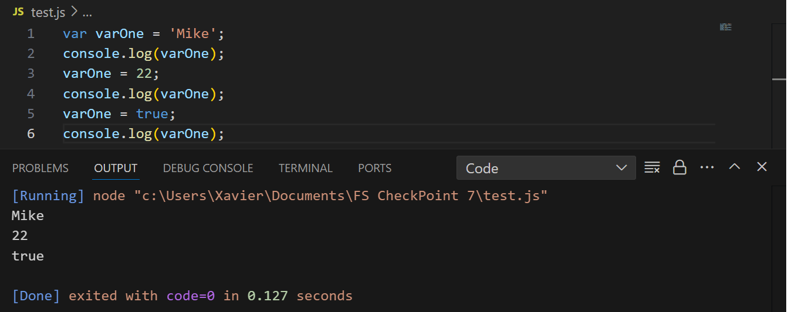

Una peculiaridad más de JS es que la declaración y la asiganción de funciones y variables es promovida o "alzada" ("hoisted" en inglés) a la parte superior de su ámbito ("scope") antes de que las instrucciones de codigo sean ejecutadas. Esta práctica es denominada comunmente como "hoisting".  

## ¿Cuáles son algunos tipos de datos JS?

Los tipos de datos más habituales disponibles en JS son: 
1. `Boolean`(booleano), es decir, verdadero (true) o falso (false)
1. `Null`, que representa a la ausencia de valor o valor vacío,
1. `undefined` (no definido), que sugiere que la variable se declaró, pero no se inicializó;
1. `Number` (número), que representa un valor numérico;
1. `String` (cadena de caracteres)
1. `Symbol` (símbolo), que es un valor único e inmutable devuelto por el objeto creado con el constructor `Symbol()`. Este identificador único puede usarse para proporcionar propiedades únicas a un objeto. 

En el código siguiente se puede ver un ejemplo de declaración de cada uno de estos tipos.

``` js
var booleano = false;
var nulo = null;
var indefinido;
var numero = 7.4;
var cadena = 'Ejemplo de String';
var símbolo = Symbol();
```
## ¿Cuáles son las tres funciones de String en JS?

Las cadenas de caracteres se usan para almacenar información que puede ser representada con caracteres alfanuméricos. En JS, las cadenas de caracteres son inmutables por lo que no pueden ser alteradas una vez creadas. Además, una cadena de caracteres carece de propiedades con lo cual se considera un tipo de valor primitivo. Para crear una cadena de caracteres primitiva se usan las cadenas de caracteres literales. Estas se pueden crear usando comillas simples (`’`), dobles (`”`) y invertidas (`\``):

``` js
const cadena1 = “Ejemplo de cadena de caracteres”;
const cadena2 = ‘Ejemplo 2 de cadena de caracteres’;
const cadena3 = `Ejemplo 3 de cadena de caracteres`;
```

Existen un buen número de métodos que nos permiten dividir cadenas de caracteres, extraer partes de la cadena, entre muchas otras funcionalidades. A modo de ejemplo, se presentan los métodos `charAt()`, `slice()` y `toUpperCase()`.
- `charAt()`: Este método devuelve el carácter que se encuentra en un índice (posición) dado, el cual debemos entrar como argumento, en el ejemplo la posición 3. Hay que tener presente que los índices en JS, como en muchos otros lenguajes, empieza en zero, por lo cual, el carácter mostrado será el cuarto.

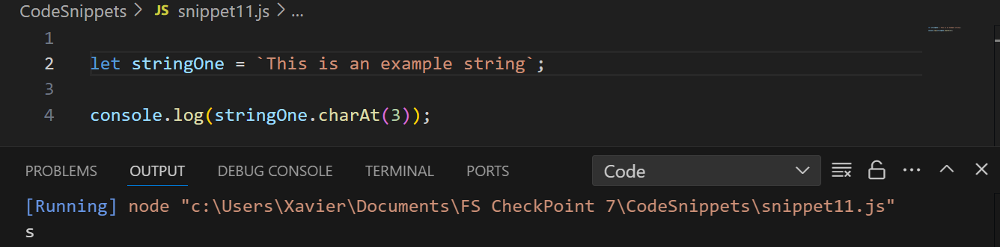

- `slice()`: Este método devuelve, una parte de una cadena de caracteres y acepta dos enteros como parámetros optativos como argumento. El primer valor define el índice inicial de la cadena y el segundo el índice del carácter final que se quiere extraer. Si se proporciona sin argumentos, el método devuelve toda la cadena. 

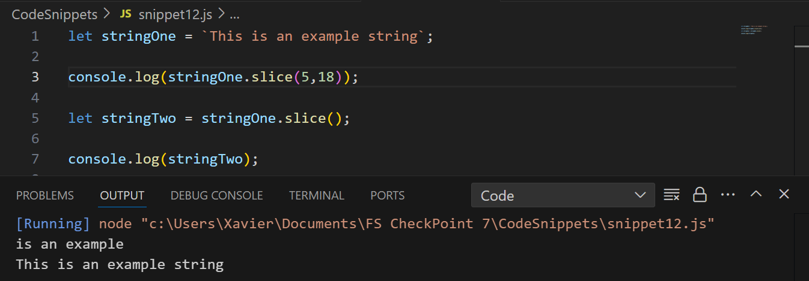

- `toLowerCase()`: Este método devuelve todo los caracteres de la cadena una vez convertidos a minúsculas. 

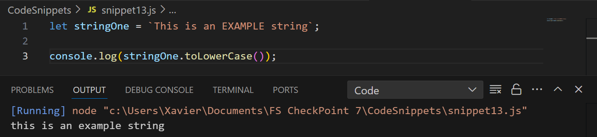

## ¿Qué es un condicional?
Los condicionales son una herramienta de JS muy potente que nos permite controlar el flujo de ejecución del código. Un condicional se evalúa esencialmente a dos estados, el estado `true` (verdadero) o el estado `false` (falso). Si el estado es verdadero se ejecutará el código mientras que, si es falso, el código no se ejecutará.

Existen distintos tipos de declaraciones o expresiones condicionales en JS. Pasemos a verlas.

### Expresion *if*

La expresión condicional más simple se denomina expresión `if`. Veamos un ejemplo:

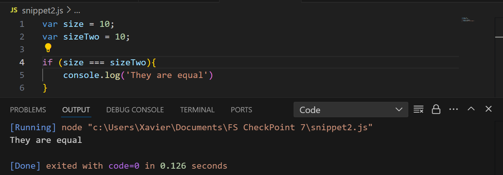

El código entre llaves se ejecuta si la condición incluida entre paréntesis se evalúa como verdadera. En este caso, se compara si las variables `size` y `sizeTwo` son idénticas. JS, a diferencia de otros lenguajes, tiene dos opciones para la realización de una comparación de igualdad. La más habitual es la que se muestra en el ejemplo, usando el operador `===` se compara igualdad de contenido y del tipo de las variables. Existe otra opción la cual requiere usar el operador `==` que compara únicamente el contenido. En el ejemplo siguiente se muestra las implicaciones de comparar dos variables que contienen “10”, uno como variable numérica y la otra como cadena de caracteres:

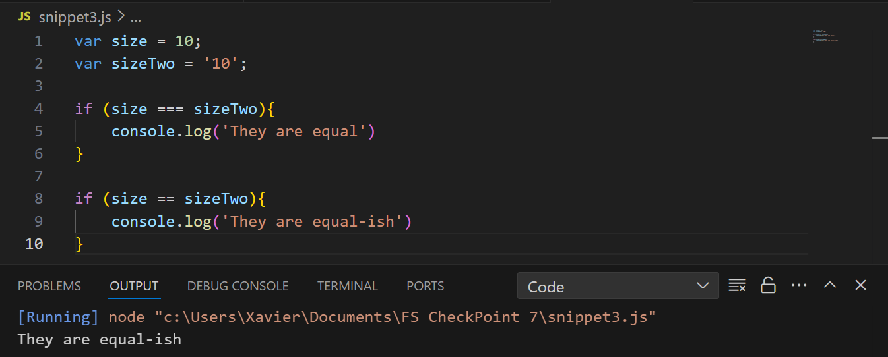

Como se puede apreciar en el ejemplo, el uso del triple signo de igualdad sugiere que las variables no son iguales mientras que si usamos doble signo de igualdad si lo sugiere. Por consiguiente, el uso de comparaciones con doble signo de igualdad debe realizarse en casos muy concretos puesto que puede inducir a errores en el código.

Además del signo de igualdad, podemos usar otros *operadores de comparación*. Estos se resumen en la tabla siguiente, la cual asume que `x = 3`:

|Operador|Descripcion|Comparacion| Resultado|
| :------: | :------: | :------: | :------:|
|==|Igual a| x == 7 <br> x == 3 <br> x == '3'|false <br> true <br> true|
|==|Igual valor y tipo| x === 3 <br> x === '3'| true <br> false|
|!=|No igual| x != 10 | true|
|!==| No igual en valor o en tipo| x !== 3 <br> x !== '3' <br> x !== 10|false <br> true <br> true|
|>|Mayor que| x > 5 |false|
|<|Menor que| x < 5 |true|
|>=|Mayor que o igual a| x >= 5 |false|
|<=|Menor que o igual a| x <= 5 |true|

### Estructura condicional if/else

En JS, como en muchos otros lenguajes, podemos utilizar condicionales compuestos. El caso más simple es la estructura “if/else”.  Veamos un ejemplo:

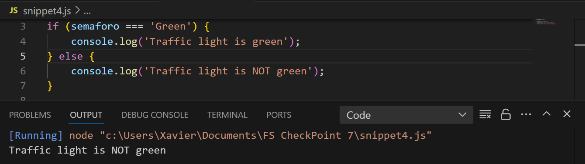

### Estructura condicional else if
 
 En casos donde el condicional compuesto if/else no es suficiente, podemos extender el nombre de comparaciones usando una estructura condicional compuesta denominada “else if”.  Esta estructura nos permite encadenar múltiples comparaciones. Cada una de las condiciones se evaluará secuencialmente hasta que una de ellas sea verdadera. En ese caso, se ejecutará el código entre llaves. Se puede añadir de manera opcional una expresión “else” que actuara como caso por defecto.

Como se aprecia en el ejemplo siguiente, la expresión `semaforo === 'Yellow'` es verdadera con lo cual el código ejecutado es ` console.log('Traffic light is yellow);`:

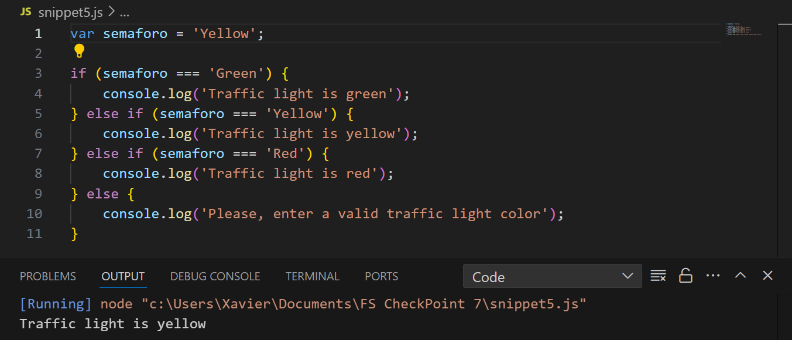

### Estructura condicional Switch

En JS, existe una estructura parecida a la estructura *else if*, denominada **_Switch_**. *Switch* es menos popular que la estructura *else if* pero en casos donde existen muchas posibles comparaciones, permite estructurar el código de manera más clara. El ejemplo anterior podría expresarse de manera equivalente usando una declaración *switch* de la siguiente manera:
Es importante recalcar que una diferencia importante entre la estructura *switch* y la estructura *else if*, es que si queremos detener la ejecución de los casos no evaluados, debemos incorporar la declaración `break;`. Si esta se omite, el código de programación no se detiene con lo que se comprueba el caso siguiente.  

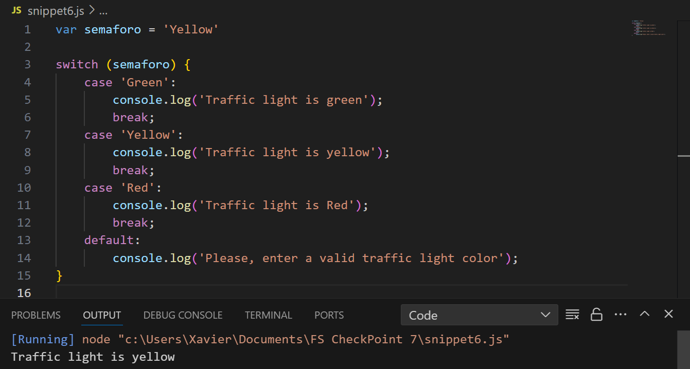

## ¿Qué es un operador ternario?

Un operador ternario es una estructura de programación que nos permite escribir un condicional *if/else* en una única línea. Si no se está familiarizado con esta sintaxis el código puede ser menos leíble, pero puede emplearse en casos donde la estructura *if/else* no puede usarse. El ejemplo siguiente verifica si la variable `semaforo` contiene la cadena de caracteres “Green” y devuelve cadenas de caracteres distintas en función de como se evalua la condición. 

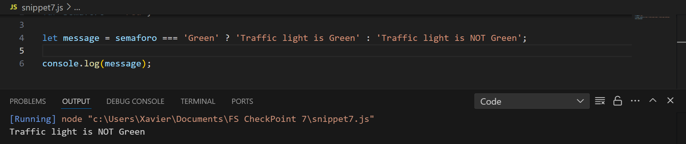

Es importante limitar el uso del operador ternario a comparaciones simples, privilegiando las estructuras condicionales vistas anteriormente para casos más complejos. 

## ¿Cuál es la diferencia entre una declaración de función y una expresión de función?

Una *declaración de función* y una *expresión de función* son similares en el sentido que nos permiten encapsular código. En el caso de una declaración de función se declara usando la palabra `function`, seguida de un nombre y paréntesis donde se declaran los argumentos de la función: 

[](./images/snippet8.png)

En una expresión de función (también denominadas función anónima), la función se almacena en una variable, y se declara con la palabra `function`, seguida de paréntesis donde se declaran los argumentos de la funcion. En el caso del ejemplo, se crea una expresión de función sin argumentos almacenada en la variable `foo`: 

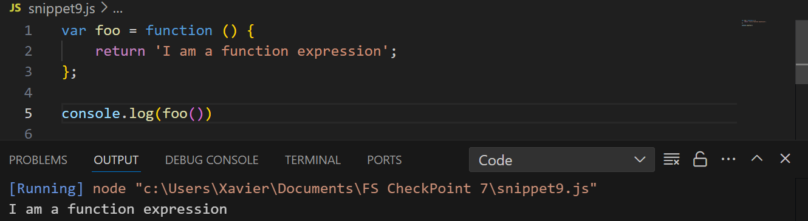

La diferencia principal entre una declaración de función y una expresión de función es que las primeras no pueden estar dentro de un bloque de código como, por ejemplo, un caso `if`.  Otra diferencia importante es que las expresiones de declaración de función no son promovidas automáticamente al principio del código (“hoisting”) y, en consecuencia, no pueden usarse antes de ser creadas.

## ¿Qué es la palabra clave "this" en JS?

La palabra clave  `this` hace referencia a la instancia de un objeto. Este objeto depende de cómo se usa la palabra clave. Si se usa de manera aislada, `this` hace referencia al objeto global el cual, en un navegador web es el objeto ventana. Aun así, lo más habitual es usarlo dentro de un objeto para hacer referencia a la instancia de dicho objeto. 

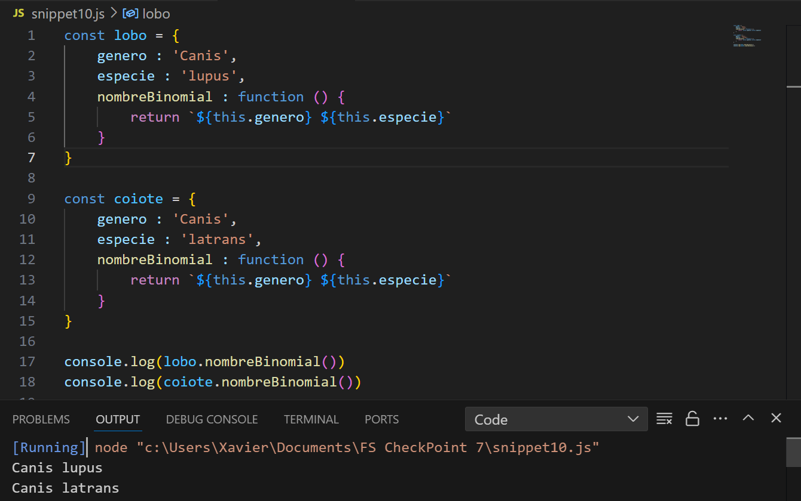

En el ejemplo se aprecia que ambos objetos tienen las propiedades genero y especie y un método denominado “nombreBinomial” que no usa argumentos. Aun así, al usar la palabra `this` delante de las propiedades, JS sabe que se está haciendo referencia a las propiedades del objeto que llama la función.  

